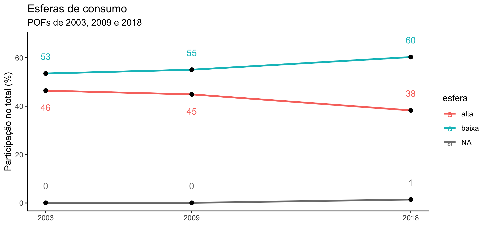
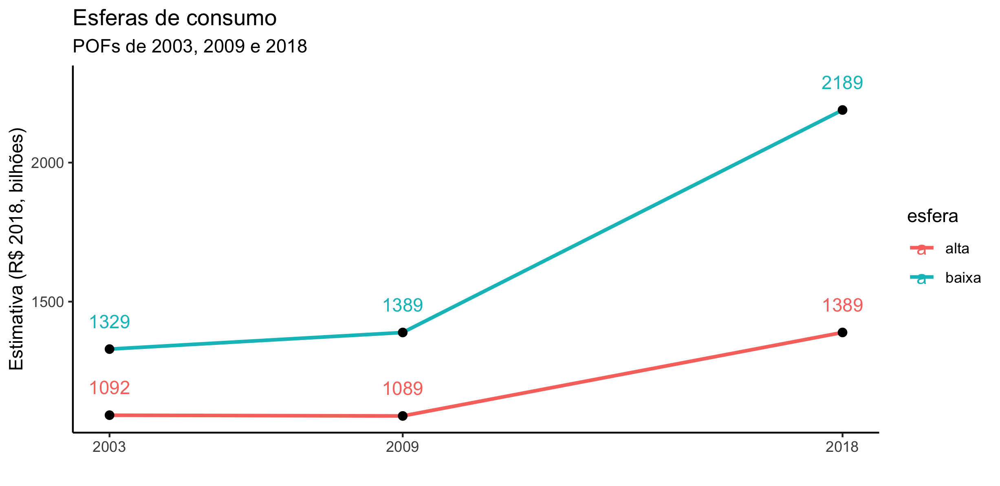
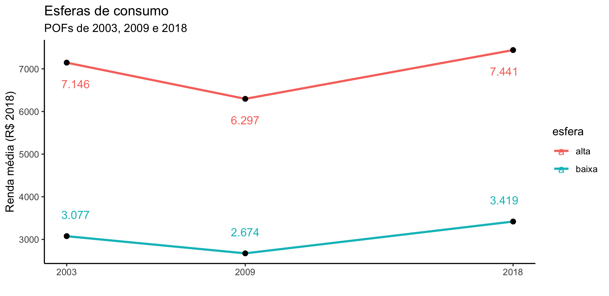
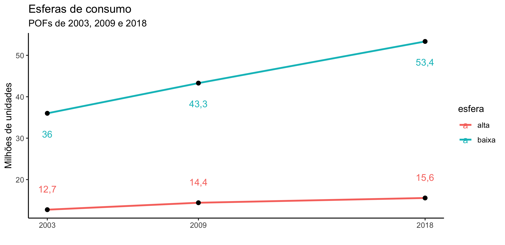

<!-- README.md is generated from README.Rmd. Please edit that file -->

> \!\!Trabalho em progresso\!\!

# 2020-09-esferas

<!-- badges: start -->

<!-- badges: end -->

Repositório destinado e servir de memória de cálculo para capítulo sobre
o desenvolvimento das esferas alta e baixa durante esse século, paseado
nas POFs de 2002/3, 2008/9 e 2017/8

Até o momento o projeto está organizado assim:

> ./  
> |  
> |— 00\_funcoes.R  
> |— 01\_rend\_resp.R  
> |— 02\_rend\_resp.R  
> |— 03\_rend\_resp.R  
> |— 04\_comparacoes.R  
> |— …  
> |— 96\_download\_leitura\_2003.R  
> |— 97\_pof2003.R  
> |— 98\_download\_leitura\_2009.R  
> |— 99\_pof2009.R

Os scripts estão numerados na ordem em que devem ser rodados na verdade
o `96` e o `98` tem que ser rodados antes do `02` e `03`.

``` r
# Isso não é boa prática, depois transformamos em pacote
source("00_funcoes.R")
# Funções carregadas
ls()
#>  [1] "classificar_rendimentos"     "classificar_rendimentos2003"
#>  [3] "classificar_rendimentos2009" "instrucoes_sas"             
#>  [5] "ler_despesas2003"            "ler_despesas2009"           
#>  [7] "ler_despesas2018"            "ler_rendimentos2003"        
#>  [9] "ler_rendimentos2009"         "ler_rendimentos2018"        
#> [11] "subst_na"

t0 <- Sys.time()
source("01_rend_desp.R")
#> Warning: package 'tidyverse' was built under R version 3.5.2
#> ── Attaching packages ─────────────────────────────────────────────────────── tidyverse 1.3.0 ──
#> ✓ ggplot2 3.2.1     ✓ purrr   0.3.3
#> ✓ tibble  2.1.3     ✓ dplyr   0.8.5
#> ✓ tidyr   1.0.2     ✓ stringr 1.4.0
#> ✓ readr   1.3.1     ✓ forcats 0.4.0
#> Warning: package 'ggplot2' was built under R version 3.5.2
#> Warning: package 'tibble' was built under R version 3.5.2
#> Warning: package 'tidyr' was built under R version 3.5.2
#> Warning: package 'purrr' was built under R version 3.5.2
#> Warning: package 'dplyr' was built under R version 3.5.2
#> Warning: package 'stringr' was built under R version 3.5.2
#> Warning: package 'forcats' was built under R version 3.5.2
#> ── Conflicts ────────────────────────────────────────────────────────── tidyverse_conflicts() ──
#> x dplyr::filter() masks stats::filter()
#> x dplyr::lag()    masks stats::lag()
#> Parsed with column specification:
#> cols(
#>   .default = col_double()
#> )
#> See spec(...) for full column specifications.
#> Parsed with column specification:
#> cols(
#>   .default = col_double()
#> )
#> See spec(...) for full column specifications.
#> Parsed with column specification:
#> cols(
#>   .default = col_double()
#> )
#> See spec(...) for full column specifications.
#> Parsed with column specification:
#> cols(
#>   UF = col_double(),
#>   ESTRATO_POF = col_double(),
#>   TIPO_SITUACAO_REG = col_double(),
#>   COD_UPA = col_double(),
#>   NUM_DOM = col_double(),
#>   NUM_UC = col_double(),
#>   QUADRO = col_character(),
#>   V9001 = col_character(),
#>   V9002 = col_double(),
#>   V8000 = col_double(),
#>   V9010 = col_double(),
#>   V9011 = col_double(),
#>   DEFLATOR = col_double(),
#>   V8000_DEFLA = col_double(),
#>   COD_IMPUT_VALOR = col_double(),
#>   FATOR_ANUALIZACAO = col_double(),
#>   PESO = col_double(),
#>   PESO_FINAL = col_double(),
#>   RENDA_TOTAL = col_double()
#> )
#> Parsed with column specification:
#> cols(
#>   .default = col_double()
#> )
#> See spec(...) for full column specifications.
#> Parsed with column specification:
#> cols(
#>   .default = col_double()
#> )
#> See spec(...) for full column specifications.
#> Parsed with column specification:
#> cols(
#>   .default = col_double()
#> )
#> See spec(...) for full column specifications.
#> Parsed with column specification:
#> cols(
#>   .default = col_double()
#> )
#> See spec(...) for full column specifications.
#> Parsed with column specification:
#> cols(
#>   .default = col_double()
#> )
#> See spec(...) for full column specifications.
Sys.time() - t0
#> Time difference of 1.738312 mins
# tabelas carregadas
ls()
#>  [1] "classificar_rendimentos"     "classificar_rendimentos2003"
#>  [3] "classificar_rendimentos2009" "corte"                      
#>  [5] "despesas_esferas"            "esferas_ucs"                
#>  [7] "instrucoes_sas"              "ler_despesas2003"           
#>  [9] "ler_despesas2009"            "ler_despesas2018"           
#> [11] "ler_rendimentos2003"         "ler_rendimentos2009"        
#> [13] "ler_rendimentos2018"         "rendas_classificadas"       
#> [15] "rendas_esferas"              "rendas_ucs"                 
#> [17] "rendas2018"                  "subst_na"                   
#> [19] "t0"
```

Ainda tem alguns arquivos ao final (98 e 99) em caráter preliminar (até
por isso essa numeração). O que eles fazem é reproduzir o trabalho de
2016.

# Resultados preliminares

## Participação relativa das esferas



## Massa dos valores das esferas (em bilhões de R$ de 2018)



## Renda média das unidades (em R$ de 2018)



## Quantidade de famílias (em milhões de unidades)


